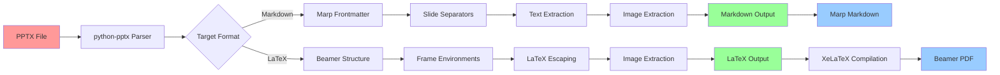

# Document Experiments

This project provides bidirectional conversion between PowerPoint, LaTeX (Beamer), and Markdown (Marp) presentations.

## Conversion Workflow



## Features

- **PowerPoint → Markdown (Marp)**: Convert PPTX files to Marp-compatible Markdown
- **PowerPoint → LaTeX (Beamer)**: Convert PPTX files to LaTeX Beamer presentations
- **Markdown → PowerPoint**: Convert Markdown files back to PPTX format
- **LaTeX → PowerPoint**: Convert LaTeX Beamer files back to PPTX format

## Installation

1. Create and activate a virtual environment:
```bash
python3 -m venv venv
source venv/bin/activate  # On Windows: venv\Scripts\activate
```

2. Install dependencies:
```bash
pip install -r requirements.txt
```

## Usage

### Basic Conversion

```bash
# PowerPoint to Markdown (Marp)
python ppt_converter.py input.pptx md

# PowerPoint to LaTeX (Beamer)
python ppt_converter.py input.pptx tex

# Markdown to PowerPoint
python ppt_converter.py input.md pptx

# LaTeX to PowerPoint
python ppt_converter.py input.tex pptx
```

### Advanced Options

```bash
# Specify output file
python ppt_converter.py input.pptx md -o output.md

# Disable Marp format (use standard Markdown)
python ppt_converter.py input.pptx md --no-marp

# Disable Beamer format (use standard LaTeX article)
python ppt_converter.py input.pptx tex --no-beamer

# Verbose output
python ppt_converter.py input.pptx md -v
```

## Output Formats

### Marp Markdown
When converting to Markdown with Marp enabled (default), the output includes:
- Marp frontmatter with theme and pagination
- Slide separators (`---`)
- Proper heading structure for presentations

### LaTeX Beamer
When converting to LaTeX with Beamer enabled (default), the output includes:
- Complete Beamer document structure
- Frame environments for each slide
- Proper LaTeX formatting and escaping

## Requirements

- Python 3.7+
- python-pptx: For PowerPoint file processing
- pypandoc: For document conversion
- markdown: For Markdown processing
- pillow: For image handling
- beautifulsoup4: For HTML/XML processing

## Example Output

The converter successfully extracts:
- Text content from slides
- Images (saved as PNG files)
- Basic formatting (headers, paragraphs)
- Slide structure and order

## Limitations

- Complex PowerPoint animations are not preserved
- Advanced formatting may require manual adjustment
- Some LaTeX special characters may need additional escaping
- Image positioning is approximate

## Contributing

Feel free to submit issues and enhancement requests!
