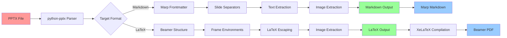

# Document Experiments

This project provides bidirectional conversion between PowerPoint, LaTeX (Beamer), and Markdown (Marp) presentations.

## Conversion Workflow



## Features

- **PowerPoint → Markdown (Marp)**: Convert PPTX files to Marp-compatible Markdown with bullet points
- **PowerPoint → LaTeX (Beamer)**: Convert PPTX files to LaTeX Beamer with custom theme extraction
- **Markdown → PowerPoint**: Convert Markdown files back to PPTX format
- **LaTeX → PowerPoint**: Convert LaTeX Beamer files back to PPTX format
- **Automatic Theme Extraction**: Analyzes PowerPoint styling to generate custom Beamer themes
- **Bullet Point Detection**: Preserves PowerPoint bullet structure in Markdown output
- **Image Extraction**: Automatically extracts and saves images as PNG files
- **Clean Build System**: Integrated Makefile with virtual environment support

## Installation

1. Create and activate a virtual environment:
```bash
python3 -m venv venv
source venv/bin/activate  # On Windows: venv\Scripts\activate
```

2. Install dependencies:
```bash
pip install -r requirements.txt
```

## Usage

### Quick Start (Recommended)

The easiest way to use the converter is with the Makefile:

```bash
# PowerPoint to Markdown (Marp)
make pptx2md

# PowerPoint to LaTeX → PDF (complete workflow)
make pptx2pdf

# Clean all generated files
make clean

# See all available targets
make help
```

### Direct Python Usage

You can also use the Python script directly:

```bash
# PowerPoint to Markdown (Marp)
python ppt_converter.py input.pptx md

# PowerPoint to LaTeX (Beamer)
python ppt_converter.py input.pptx tex

# Markdown to PowerPoint
python ppt_converter.py input.md pptx

# LaTeX to PowerPoint
python ppt_converter.py input.tex pptx
```

### Advanced Options

```bash
# Specify output file
python ppt_converter.py input.pptx md -o output.md

# Disable Marp format (use standard Markdown)
python ppt_converter.py input.pptx md --no-marp

# Disable Beamer format (use standard LaTeX article)
python ppt_converter.py input.pptx tex --no-beamer

# Verbose output
python ppt_converter.py input.pptx md -v
```

## Output Formats

### Marp Markdown
When converting to Markdown with Marp enabled (default), the output includes:
- Marp frontmatter with theme and pagination
- Slide separators (`---`)
- Proper heading structure for presentations
- **Bullet point extraction** from PowerPoint
- Image references with automatic extraction

### LaTeX Beamer
When converting to LaTeX with Beamer enabled (default), the output includes:
- Complete Beamer document structure
- Frame environments for each slide
- **Custom theme generation** based on PowerPoint analysis
- Proper LaTeX formatting and escaping
- Font size and color extraction from original slides

## Project Structure

```
Document-Experiments/
├── pptx/                    # Input and generated files
│   ├── *.pptx              # Input PowerPoint files
│   ├── *.md                # Generated Markdown files
│   ├── *.tex               # Generated LaTeX files
│   └── *.png               # Extracted images
├── build/                  # LaTeX compilation artifacts
├── output/                 # Final PDF outputs
├── ppt_converter.py        # Main conversion script
├── Makefile               # Build system
├── requirements.txt       # Python dependencies
└── README.md              # This file
```

## Requirements

- Python 3.7+
- python-pptx: For PowerPoint file processing
- pypandoc: For document conversion
- markdown: For Markdown processing
- pillow: For image handling
- beautifulsoup4: For HTML/XML processing

## Current Capabilities

The converter successfully extracts:
- **Text content** from slides with proper formatting
- **Bullet points** with indentation levels preserved
- **Images** (saved as PNG files in pptx/ directory)
- **Slide titles** (partial - using first text element)
- **Theme information** for custom Beamer generation
- **Font sizes** and color schemes from PowerPoint
- **Slide structure** and order

## Limitations

- **Title extraction**: Currently uses "Slide X" fallback for some slides
- **Complex PowerPoint animations** are not preserved
- **Advanced formatting** may require manual adjustment
- **Some LaTeX special characters** may need additional escaping
- **Image positioning** is approximate
- **Theme extraction**: Basic font/size analysis, not full visual replication

## Getting Started

1. **Clone the repository:**
   ```bash
   git clone <repository-url>
   cd Document-Experiments
   ```

2. **Set up the environment:**
   ```bash
   python3 -m venv venv
   source venv/bin/activate
   pip install -r requirements.txt
   ```

3. **Add your PowerPoint file:**
   ```bash
   cp your-presentation.pptx pptx/
   ```

4. **Convert:**
   ```bash
   make pptx2md    # For Markdown
   make pptx2pdf   # For PDF
   ```

## Contributing

Feel free to submit issues and enhancement requests! Key areas for improvement:
- Better title extraction from PowerPoint slides
- Enhanced theme detection and replication
- Support for complex animations and transitions
- Improved image positioning and scaling
