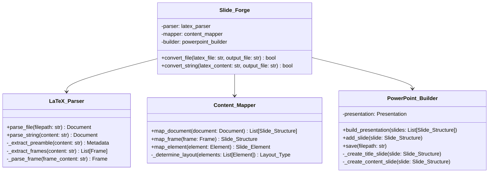
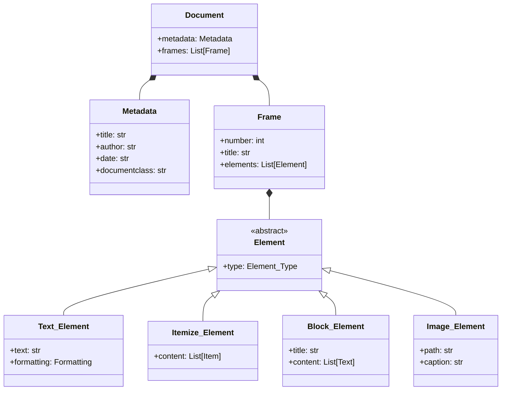
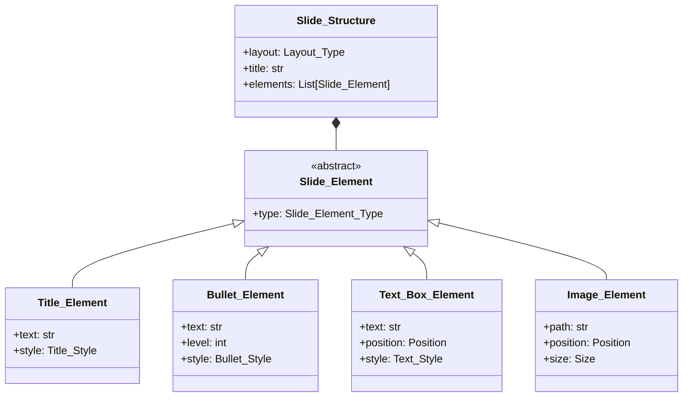
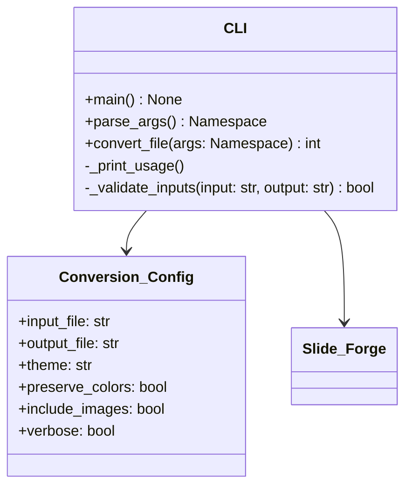
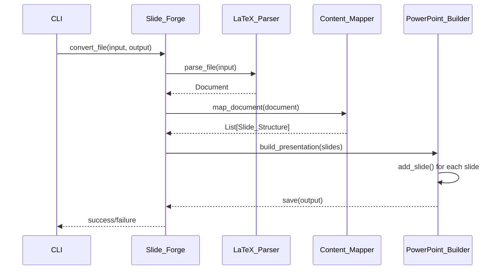
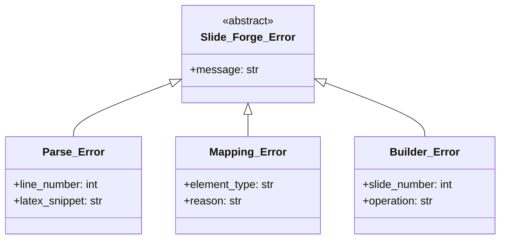
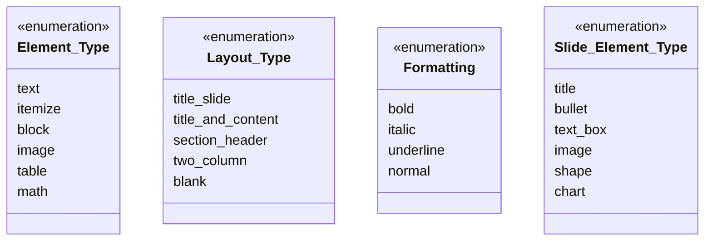

# Class Diagrams

This section contains detailed class diagrams for the Slide Forge architecture.

## Core Architecture



## Data Model



## PowerPoint Output Model



## CLI Application



## Component Interactions



## Error Handling



## Enums and Types



## Architecture Overview

### Design Principles

1. **Separation of Concerns**: Each component has a single responsibility
2. **Modularity**: Components can be tested and developed independently
3. **Extensibility**: Easy to add new parsers, mappers, or builders
4. **Error Handling**: Comprehensive error reporting and recovery

### Component Responsibilities

#### Slide_Forge (Main Controller)
- Orchestrates the conversion workflow
- Manages configuration and options
- Handles error reporting and logging

#### LaTeX_Parser
- Parses LaTeX Beamer syntax
- Extracts document structure and content
- Handles LaTeX-specific features

#### Content_Mapper
- Maps LaTeX elements to PowerPoint equivalents
- Determines slide layouts and styling
- Handles content transformation logic

#### PowerPoint_Builder
- Creates PowerPoint presentations
- Manages slide layouts and formatting
- Handles PowerPoint-specific features

### Data Flow

1. **Input**: LaTeX Beamer file (.tex)
2. **Parsing**: Extract structured data (Document, Frames, Elements)
3. **Mapping**: Transform to PowerPoint structure (Slide_Structure)
4. **Building**: Create PowerPoint file (.pptx)
5. **Output**: PowerPoint presentation

### Extension Points

- **New Parsers**: Support different LaTeX variants or formats
- **Custom Mappers**: Handle specialized content types
- **Alternative Builders**: Support other output formats
- **Theme System**: Custom styling and layouts

## Implementation Notes

### Naming Conventions

- **Classes**: PascalCase with underscores (e.g., `Slide_Forge`, `LaTeX_Parser`)
- **Methods**: snake_case (e.g., `convert_file`, `parse_string`)
- **Variables**: snake_case (e.g., `latex_file`, `output_file`)
- **Constants**: UPPER_SNAKE_CASE (e.g., `DEFAULT_THEME`)

### File Organization

```
src/slideforge/
├── __init__.py           # Main exports
├── core.py              # Slide_Forge class
├── parsers/
│   ├── __init__.py
│   ├── latex_parser.py  # LaTeX_Parser class
│   └── base_parser.py   # Base parsing functionality
├── mappers/
│   ├── __init__.py
│   ├── content_mapper.py # Content_Mapper class
│   └── element_mappers.py # Element-specific mappers
├── builders/
│   ├── __init__.py
│   ├── powerpoint_builder.py # PowerPoint_Builder class
│   └── slide_builders.py # Slide-specific builders
├── models/
│   ├── __init__.py
│   ├── document.py      # Document, Frame, Element classes
│   ├── slide_structure.py # Slide_Structure, Slide_Element classes
│   └── metadata.py      # Metadata and related classes
└── exceptions.py        # Custom exception classes
```

### Testing Strategy

- **Unit Tests**: Test each class independently
- **Integration Tests**: Test component interactions
- **End-to-End Tests**: Test complete conversion workflow
- **Sample Files**: Test with various LaTeX Beamer presentations
