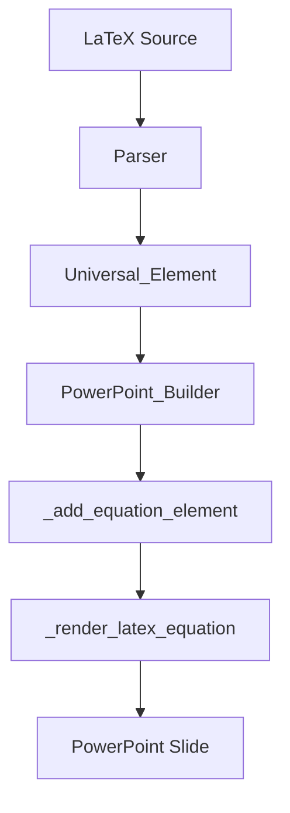
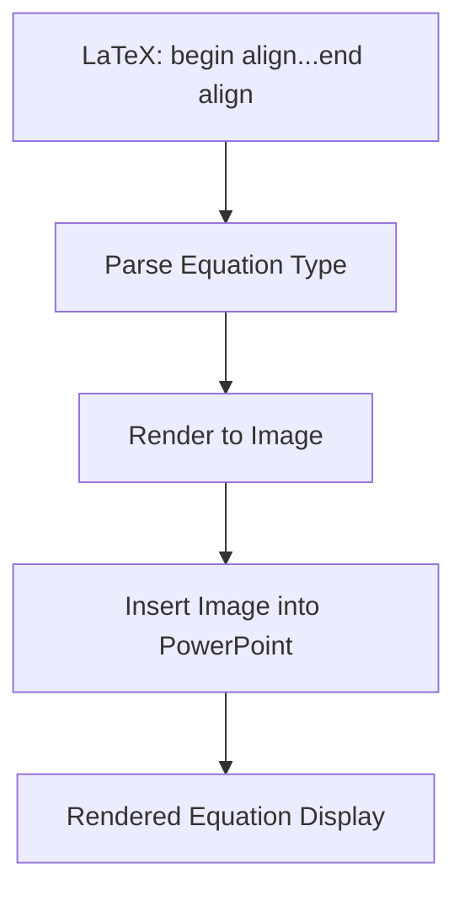
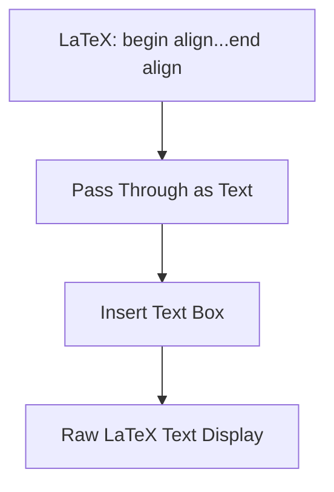
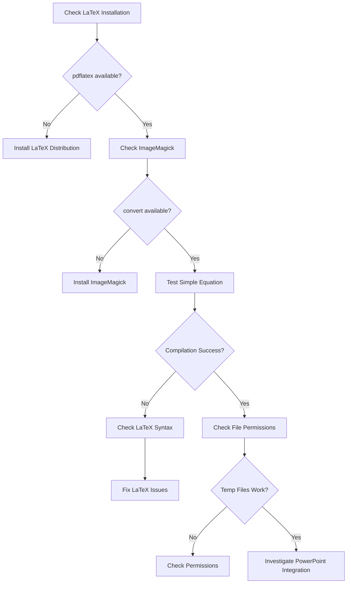
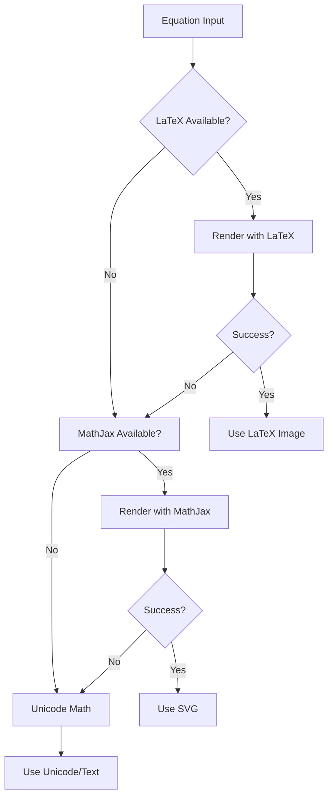

# Equation Rendering Workflow Analysis

## Problem Overview
LaTeX equations are appearing as raw text in PowerPoint slides instead of being rendered as mathematical equations or images.

## Current Input Flow



## Expected vs Actual Behavior

### Expected Workflow


### Actual Workflow


## Detailed Algorithm Analysis

### 1. Input Processing
**Input Types:**
- Inline equations: `$x^2 + 1$`
- Display equations: `$$x^2 + 1$$`
- Align environments: `\begin{align}...\end{align}`
- Other LaTeX environments

**Current Universal_Element Structure:**
```python
Universal_Element(
    element_type=Element_Type.EQUATION,
    content={
        'latex': r'\begin{align} f(x) &= x^2 + 2x + 1 \\ f\'(x) &= 2x + 2 \\ f\'\'(x) &= 2 \end{align}',
        'type': 'display'  # or 'inline'
    },
    position=None,  # or Position object
    size=None       # or Size object
)
```

### 2. Current Implementation Analysis

#### _add_equation_element Method
```python
def _add_equation_element(self, slide_obj, element: Universal_Element,
                        config: Dict[str, Any], source_path: str = ''):
    """Add an equation element by rendering LaTeX to image."""
    try:
        # Extract LaTeX content
        if isinstance(element.content, dict):
            latex_content = element.content.get('latex', '')
            equation_type = element.content.get('type', 'inline')
        else:
            latex_content = str(element.content)
            equation_type = 'inline'

        # Render LaTeX to image
        image_path = self._render_latex_equation(latex_content, equation_type, source_path)
        
        if image_path and image_path.exists():
            # Add rendered image to slide
            left = Inches(1) if element.position else Inches(1)
            top = Inches(2) if not hasattr(element, 'current_top') else element.current_top
            width = Inches(6) if element.size else Inches(6)
            height = Inches(2) if element.size else None
            
            slide_obj.shapes.add_picture(str(image_path), left, top, width, height)
        else:
            # Fallback: add as text (THIS IS THE PROBLEM)
            self._add_equation_as_text(slide_obj, element, config)
            
    except Exception as e:
        self.logger.warning(f"Failed to add equation element: {e}")
```

#### _render_latex_equation Method
```python
def _render_latex_equation(self, latex_equation: str, equation_type: str, source_path: str = '') -> Optional[Path]:
    """Render LaTeX equation to PNG image using temporary files."""
    try:
        # Create temporary LaTeX document
        with tempfile.NamedTemporaryFile(mode='w', suffix='.tex', delete=False) as tex_file:
            # Write LaTeX preamble + equation
            tex_content = self._create_latex_document(latex_equation, equation_type)
            tex_file.write(tex_content)
            tex_path = tex_file.name

        # Compile LaTeX to PDF
        pdf_path = tex_path.replace('.tex', '.pdf')
        subprocess.run(['pdflatex', tex_path], check=True, capture_output=True)
        
        # Convert PDF to PNG
        png_path = tex_path.replace('.tex', '.png')
        subprocess.run(['convert', pdf_path, png_path], check=True, capture_output=True)
        
        return Path(png_path)
        
    except Exception as e:
        self.logger.error(f"Failed to render LaTeX equation: {e}")
        return None
```

## Why This Is Difficult

### 1. LaTeX Dependencies
**Required Tools:**
- `pdflatex` - LaTeX compiler
- `ImageMagick` or `ghostscript` - PDF to image conversion
- LaTeX packages: `amsmath`, `amssymb`, etc.

**Failure Points:**
- Tools not installed on system
- LaTeX packages missing
- Permission issues with temporary files
- Compilation errors in LaTeX

### 2. Cross-Platform Compatibility


### 3. Performance Considerations
- LaTeX compilation is slow (1-3 seconds per equation)
- Multiple equations on one slide = significant delay
- Temporary file cleanup required

### 4. Quality and Scaling
- DPI settings for image quality
- Proper sizing for different equation types
- Background transparency issues
- Font consistency with PowerPoint theme

## Current Failure Analysis

### Most Likely Issues:
1. **LaTeX not installed** - Most common failure
2. **Missing packages** - `amsmath` for align environments
3. **Path issues** - Tools not in system PATH
4. **Permission errors** - Can't write temp files
5. **Compilation errors** - Invalid LaTeX syntax

### Debugging Steps Needed:


## Proposed Solutions

### Option 1: Robust LaTeX Pipeline
```python
def _render_latex_equation_robust(self, latex_equation: str, equation_type: str):
    """Enhanced LaTeX rendering with fallbacks."""
    
    # 1. Check dependencies
    if not self._check_latex_dependencies():
        raise BuilderError("LaTeX dependencies not available")
    
    # 2. Validate LaTeX syntax
    if not self._validate_latex_syntax(latex_equation):
        raise BuilderError("Invalid LaTeX syntax")
    
    # 3. Create robust document
    tex_content = self._create_latex_document(latex_equation, equation_type)
    
    # 4. Compile with error handling
    try:
        return self._compile_latex_to_image(tex_content)
    except Exception as e:
        self.logger.error(f"LaTeX compilation failed: {e}")
        return None
```

### Option 2: Alternative Math Rendering
```python
def _render_equation_alternative(self, latex_equation: str):
    """Fallback math rendering options."""
    
    # Option A: MathJax to SVG
    if self._mathjax_available():
        return self._render_with_mathjax(latex_equation)
    
    # Option B: Unicode Math
    return self._render_as_unicode_math(latex_equation)
    
    # Option C: Plain text with formatting
    return self._render_as_formatted_text(latex_equation)
```

### Option 3: Hybrid Approach


## Immediate Actions Required

1. **Check system dependencies**
2. **Add comprehensive logging** to identify failure points
3. **Implement fallback mechanisms**
4. **Add error recovery** for partial failures
5. **Test with sample equations** of varying complexity

## Testing Strategy

```python
# Test cases to validate equation rendering
test_equations = [
    # Simple inline
    ("$x^2 + 1$", "inline"),
    # Simple display
    ("$$x^2 + 1$$", "display"),
    # Complex align
    (r"\begin{align} f(x) &= x^2 \\ f'(x) &= 2x \end{align}", "display"),
    # Matrix
    (r"\begin{pmatrix} 1 & 2 \\ 3 & 4 \end{pmatrix}", "display"),
    # Greek letters
    (r"$\alpha + \beta = \gamma$", "inline"),
    # Fractions
    (r"$\frac{1}{x+1}$", "inline"),
]
```

This analysis shows that the core issue is likely in the LaTeX rendering pipeline, not the PowerPoint integration itself.
