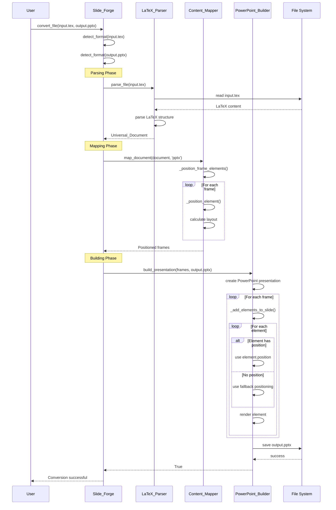
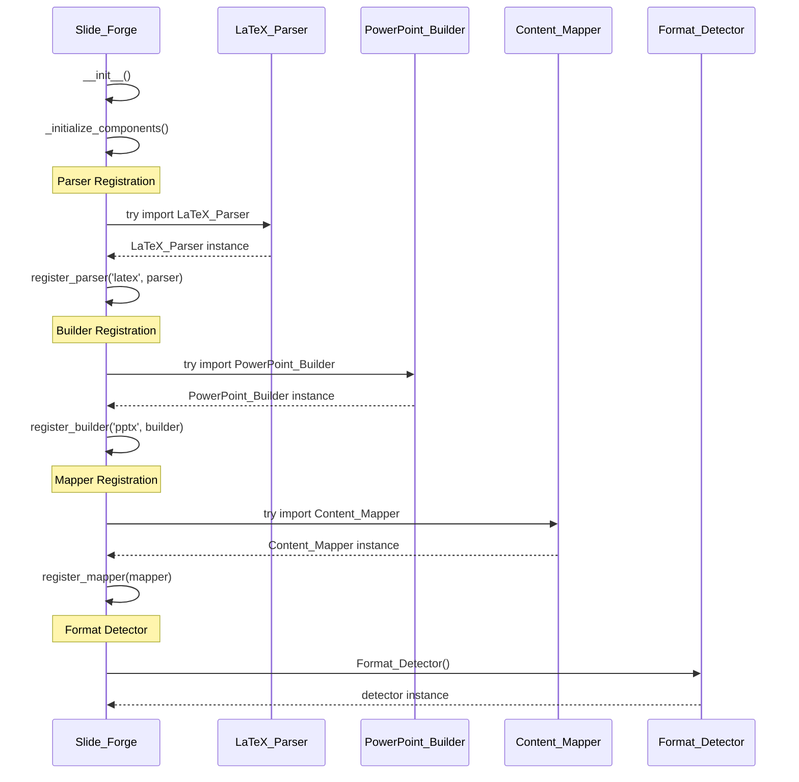
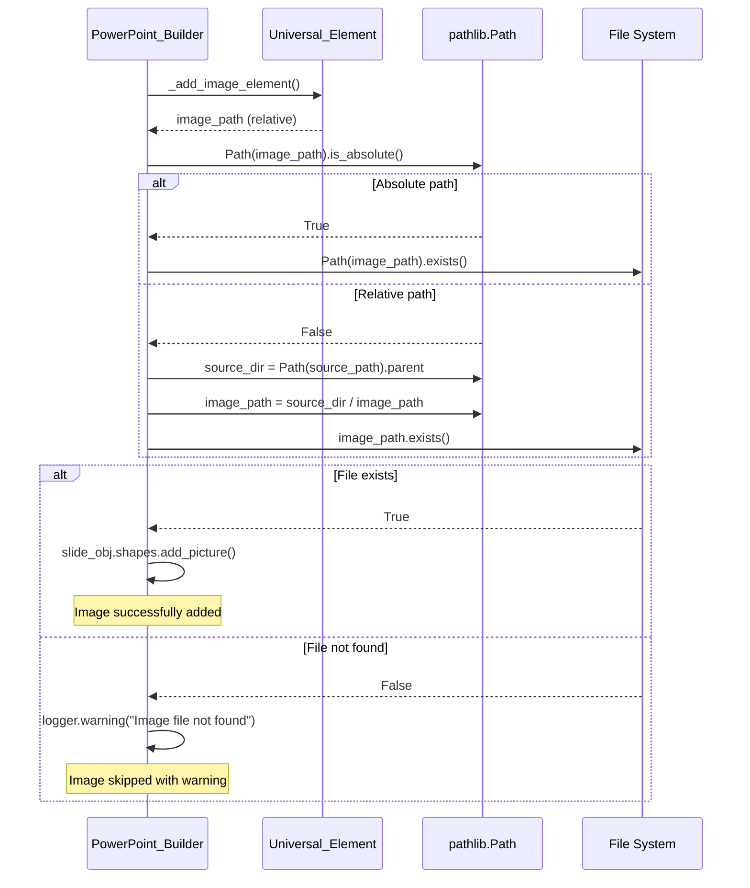
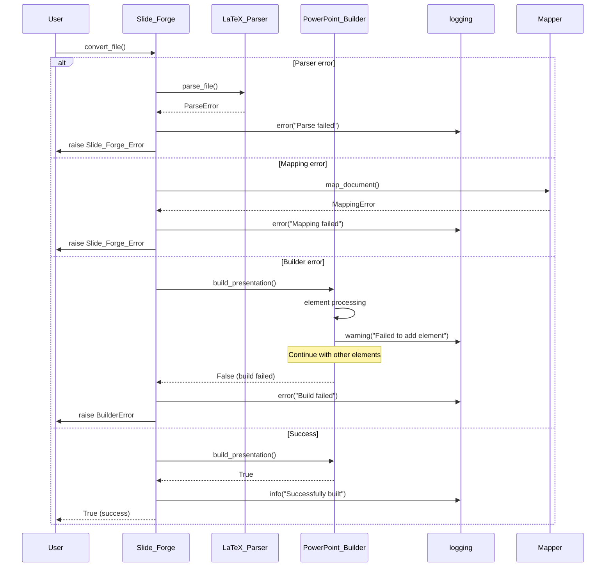
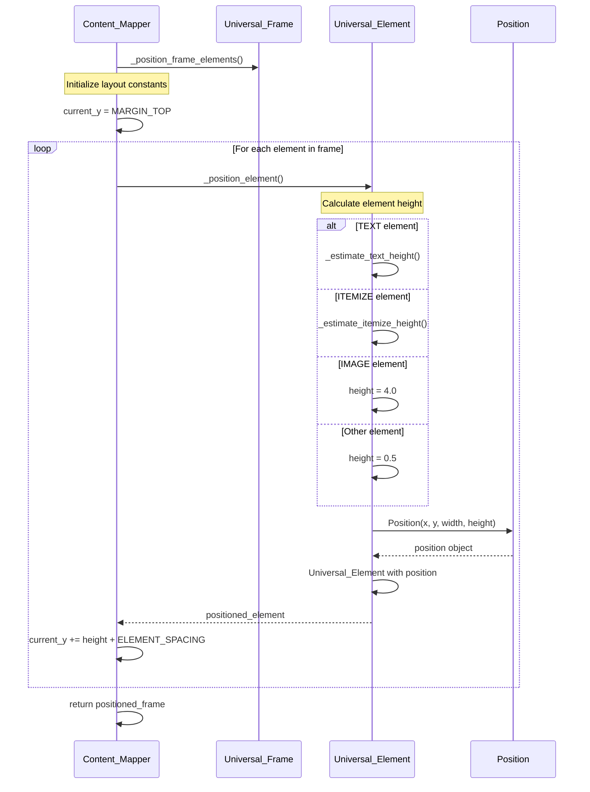
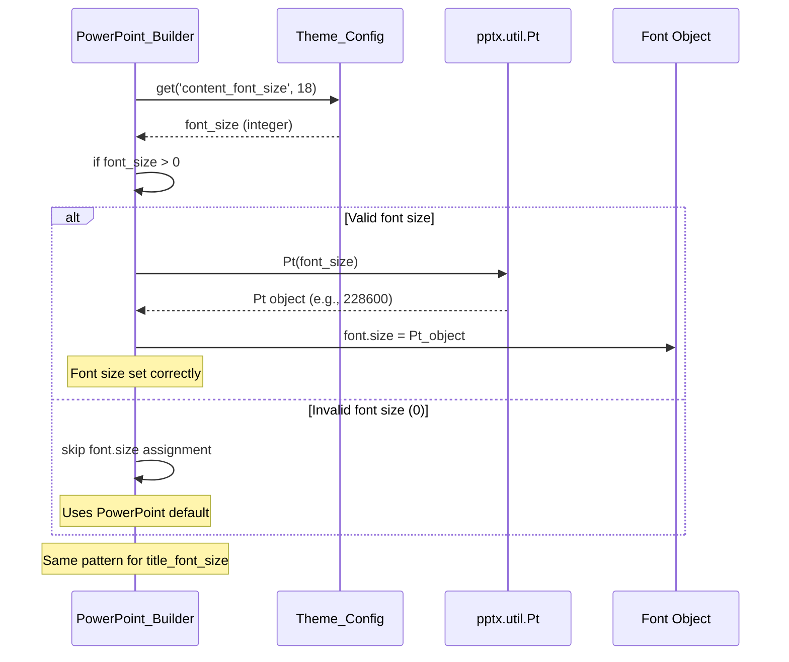

# Sequence Diagrams

This page contains sequence diagrams that illustrate the flow of operations within Slide Forge.

## Conversion Flow Diagram

## Component Initialization Diagram

## Image Path Resolution Diagram

## Error Handling Flow

## Layout Positioning Flow

## Font Size Handling Flow

These sequence diagrams illustrate the key flows and interactions within the Slide Forge system, helping developers understand the architecture and data flow.
