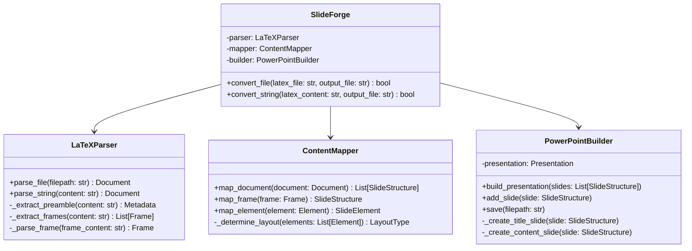
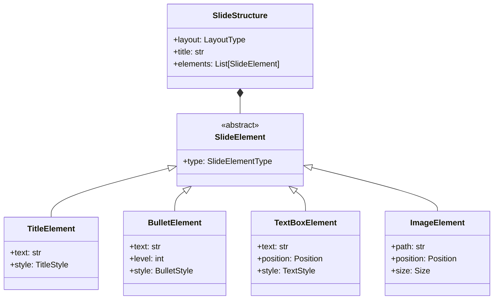
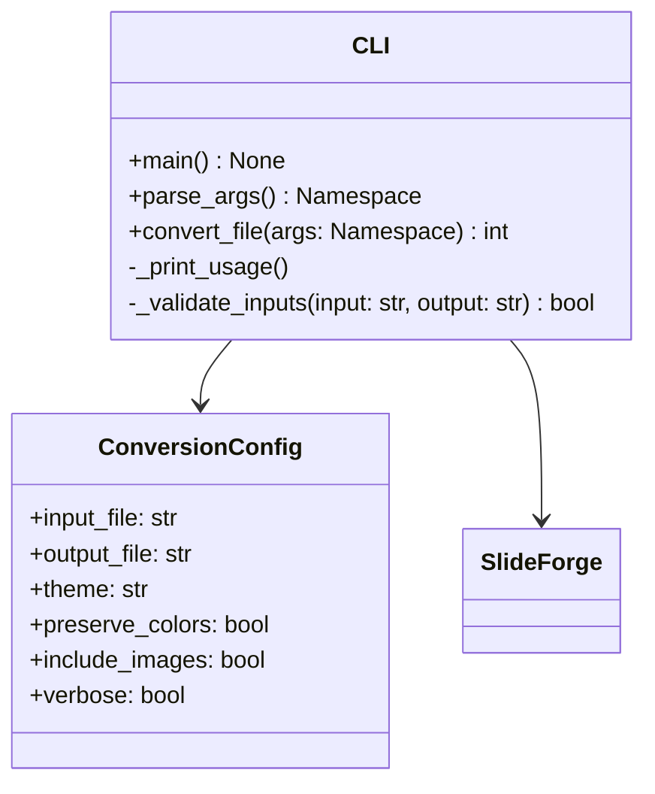
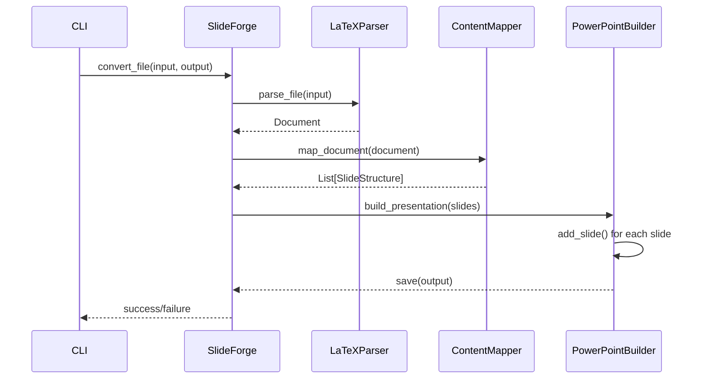
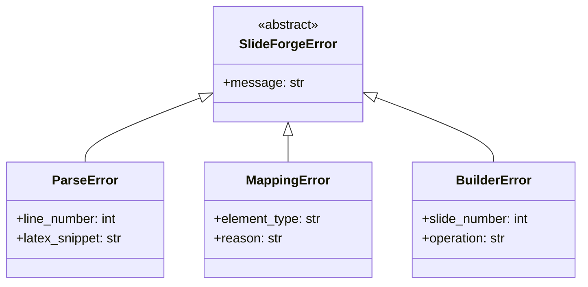
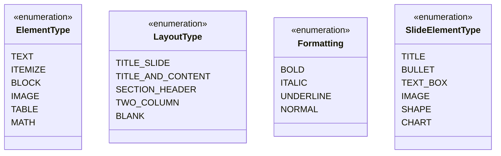

# Slide Forge Class Diagrams

## Core Architecture

```mermaid
classDiagram
    class SlideForge {
        -parser: LaTeXParser
        -mapper: ContentMapper
        -builder: PowerPointBuilder
        +convert_file(latex_file: str, output_file: str) bool
        +convert_string(latex_content: str, output_file: str) bool
    }

    class LaTeXParser {
        +parse_file(filepath: str) Document
        +parse_string(content: str) Document
        -_extract_preamble(content: str) Metadata
        -_extract_frames(content: str) List[Frame]
        -_parse_frame(frame_content: str) Frame
    }

    class ContentMapper {
        +map_document(document: Document) List[SlideStructure]
        +map_frame(frame: Frame) SlideStructure
        +map_element(element: Element) SlideElement
        -_determine_layout(elements: List[Element]) LayoutType
    }

    class PowerPointBuilder {
        -presentation: Presentation
        +build_presentation(slides: List[SlideStructure])
        +add_slide(slide: SlideStructure)
        +save(filepath: str)
        -_create_title_slide(slide: SlideStructure)
        -_create_content_slide(slide: SlideStructure)
    }

    SlideForge --> LaTeXParser
    SlideForge --> ContentMapper
    SlideForge --> PowerPointBuilder
```

## Data Model

```mermaid
classDiagram
    class Document {
        +metadata: Metadata
        +frames: List[Frame]
    }

    class Metadata {
        +title: str
        +author: str
        +date: str
        +documentclass: str
    }

    class Frame {
        +number: int
        +title: str
        +elements: List[Element]
    }

    class Element {
        <<abstract>>
        +type: ElementType
    }

    class TextElement {
        +text: str
        +formatting: Formatting
    }

    class ItemizeElement {
        +content: List[Item]
    }

    class BlockElement {
        +title: str
        +content: List[Text]
    }

    class ImageElement {
        +path: str
        +caption: str
    }

    Element <|-- TextElement
    Element <|-- ItemizeElement
    Element <|-- BlockElement
    Element <|-- ImageElement

    Document *-- Metadata
    Document *-- Frame
    Frame *-- Element
```

## PowerPoint Output Model

```mermaid
classDiagram
    class SlideStructure {
        +layout: LayoutType
        +title: str
        +elements: List[SlideElement]
    }

    class SlideElement {
        <<abstract>>
        +type: SlideElementType
    }

    class TitleElement {
        +text: str
        +style: TitleStyle
    }

    class BulletElement {
        +text: str
        +level: int
        +style: BulletStyle
    }

    class TextBoxElement {
        +text: str
        +position: Position
        +style: TextStyle
    }

    class ImageElement {
        +path: str
        +position: Position
        +size: Size
    }

    SlideElement <|-- TitleElement
    SlideElement <|-- BulletElement
    SlideElement <|-- TextBoxElement
    SlideElement <|-- ImageElement

    SlideStructure *-- SlideElement
```

## CLI Application

```mermaid
classDiagram
    class CLI {
        +main() None
        +parse_args() Namespace
        +convert_file(args: Namespace) int
        -_print_usage()
        -_validate_inputs(input: str, output: str) bool
    }

    class ConversionConfig {
        +input_file: str
        +output_file: str
        +theme: str
        +preserve_colors: bool
        +include_images: bool
        +verbose: bool
    }

    CLI --> ConversionConfig
    CLI --> SlideForge
```

## Component Interactions

```mermaid
sequenceDiagram
    participant CLI
    participant SlideForge
    participant LaTeXParser
    participant ContentMapper
    participant PowerPointBuilder

    CLI->>SlideForge: convert_file(input, output)
    SlideForge->>LaTeXParser: parse_file(input)
    LaTeXParser-->>SlideForge: Document
    SlideForge->>ContentMapper: map_document(document)
    ContentMapper-->>SlideForge: List[SlideStructure]
    SlideForge->>PowerPointBuilder: build_presentation(slides)
    PowerPointBuilder->>PowerPointBuilder: add_slide() for each slide
    PowerPointBuilder-->>SlideForge: save(output)
    SlideForge-->>CLI: success/failure
```

## Error Handling

```mermaid
classDiagram
    class SlideForgeError {
        <<abstract>>
        +message: str
    }

    class ParseError {
        +line_number: int
        +latex_snippet: str
    }

    class MappingError {
        +element_type: str
        +reason: str
    }

    class BuilderError {
        +slide_number: int
        +operation: str
    }

    SlideForgeError <|-- ParseError
    SlideForgeError <|-- MappingError
    SlideForgeError <|-- BuilderError
```

## Enums and Types

```mermaid
classDiagram
    class ElementType {
        <<enumeration>>
        TEXT
        ITEMIZE
        BLOCK
        IMAGE
        TABLE
        MATH
    }

    class LayoutType {
        <<enumeration>>
        TITLE_SLIDE
        TITLE_AND_CONTENT
        SECTION_HEADER
        TWO_COLUMN
        BLANK
    }

    class Formatting {
        <<enumeration>>
        BOLD
        ITALIC
        UNDERLINE
        NORMAL
    }

    class SlideElementType {
        <<enumeration>>
        TITLE
        BULLET
        TEXT_BOX
        IMAGE
        SHAPE
        CHART
    }
```
